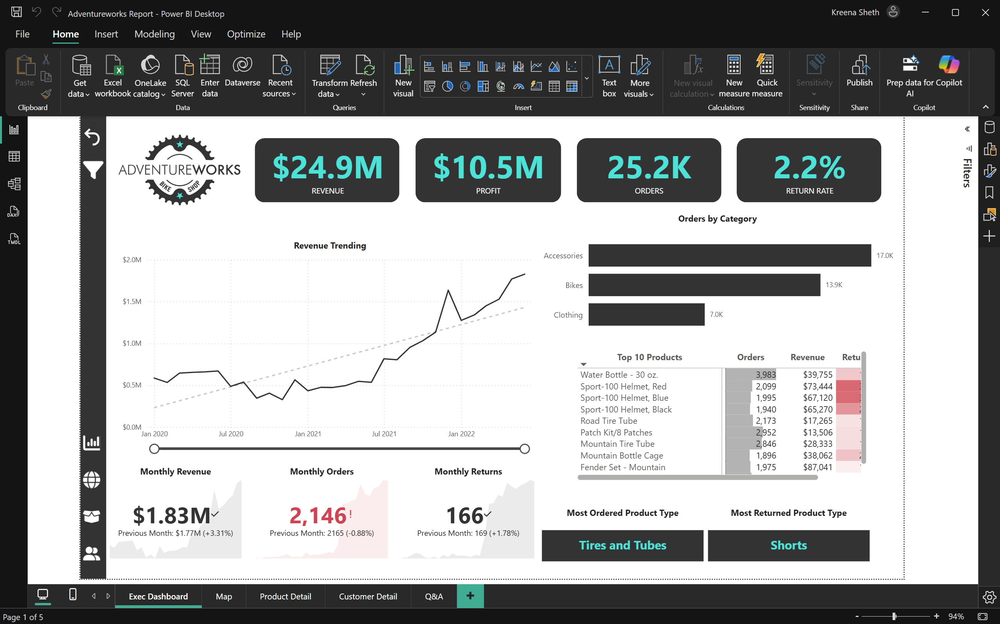
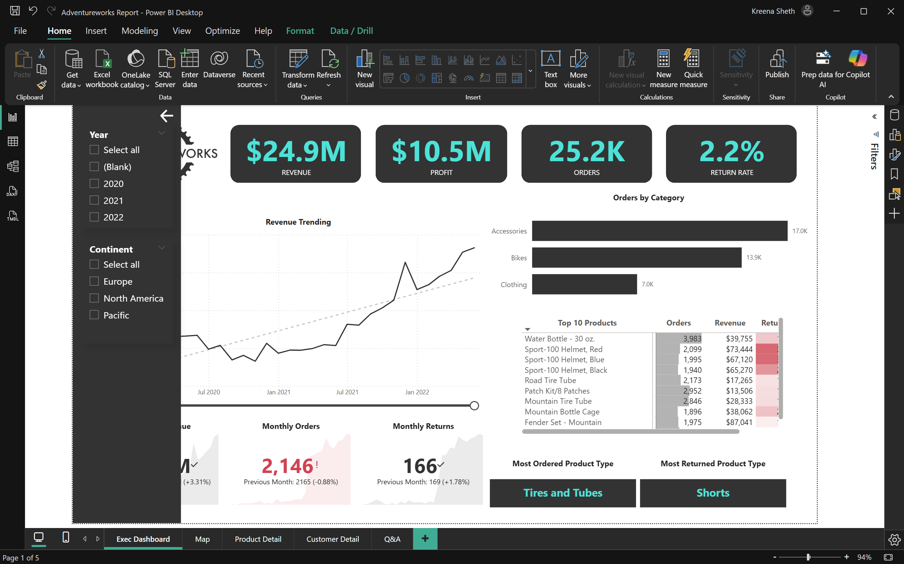
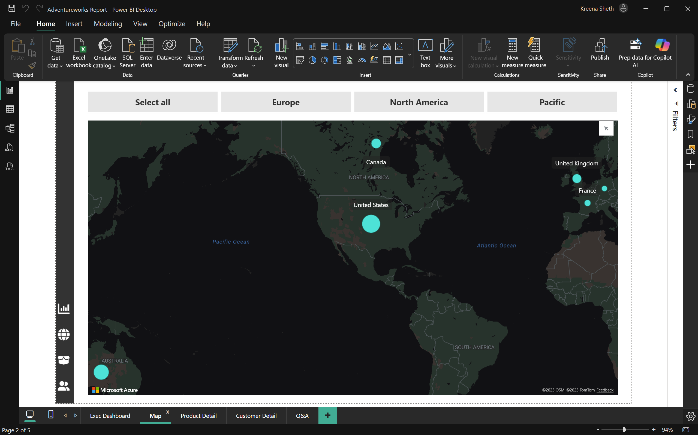
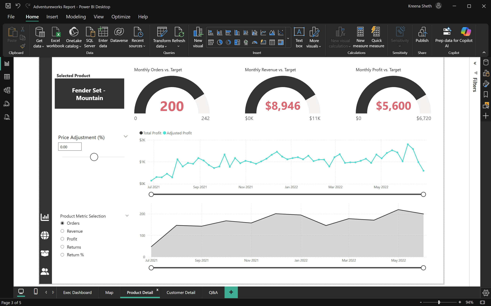
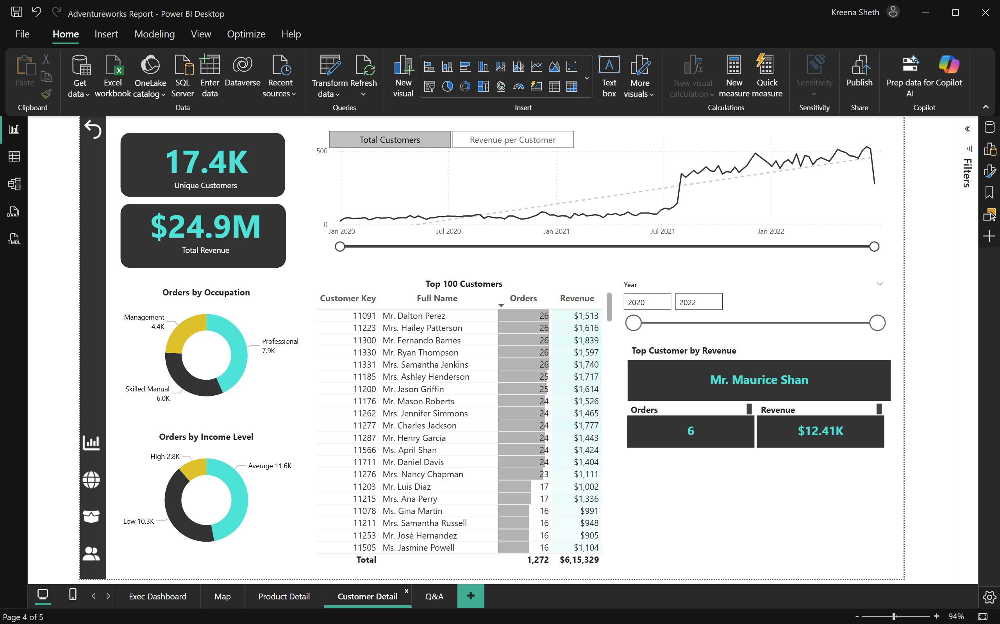

# Summary
Interactive Power BI dashboard built using the Microsoft Power BI Desktop course offered by the Maven Analytics team on Udemy. The project was a business intelligence assignment, where the management of a global manufacturing company that produces cycling equipment and accessories wants to track it’s key performance indicators (sales, profits, revenues and returns).

The goals were to;

Compare regional performance.
Analyze product level trends
Identify high value customers.
I used Power BI to connect and transform the raw data, to build relational data models, to create calculated columns and measures using DAX and finally to design an interactive dashboard for visualization. That is a highly summarized overview of what I interacted with, and the course combs through the entire Power BI interface thoroughly.The dashboard had four pages, one for the executive team, one that had the geographical data, one that analyzed the products and finally a page for the customers.

---
## Dashboard Pages

## Executive Dashboard
The executive team’s page showed a summarized view of the company’s KPIs, with 24.9 million dollars in revenue, 25,200 orders, 10.5 million dollars in revenue and a return rate of 2.2 percent. The accessories product category led by amount of orders, followed by bikes and finally clothing. We can also see a simple matrix of the leading ten products showing the orders, revenue and the return rate.

 

The page can be further filtered to show these metrics by region and year.

---

### Geography Analysis
Map-based view highlighting regional performance and identifying strong and underperforming markets.  

### Product Performance
Product-level trends including KPI performance against targets, profit contribution, and returns. For this particular product, Although the Fender Set – Mountain shows steady demand and improving order volume, it consistently underperforms against revenue and profit targets, indicating margin pressure and opportunities for pricing and cost optimization.

### Customer Insights
Customer segmentation and revenue contribution are used to identify high-value customers, revealing that a relatively small customer segment accounts for a significant share of total revenue and plays a critical role in overall performance.  

---

## Tools & Skills Used
- Microsoft Power BI Desktop  
- Power Query (data cleaning & transformation)  
- Data Modeling  
- DAX (measures & calculated columns)  
- Interactive & AI visuals  

---

## Live Power BI Dashboard
[View the interactive Power BI dashboard][PASTE_POWER_BI_SERVICE_LINK_HERE](https://app.powerbi.com/groups/me/reports/8cf33330-f6c5-4794-9f8e-b8fe85c7f864/65f078d0c678d56138b6?redirectedFromSignup=1&experience=power-bi)
---

## Dashboard Walkthrough

🎥 [Watch the dashboard walkthrough video](https://drive.google.com/file/d/1lw7TsRavECqbw9eqvps1D-P8GberhcNZ/view?usp=sharing)

